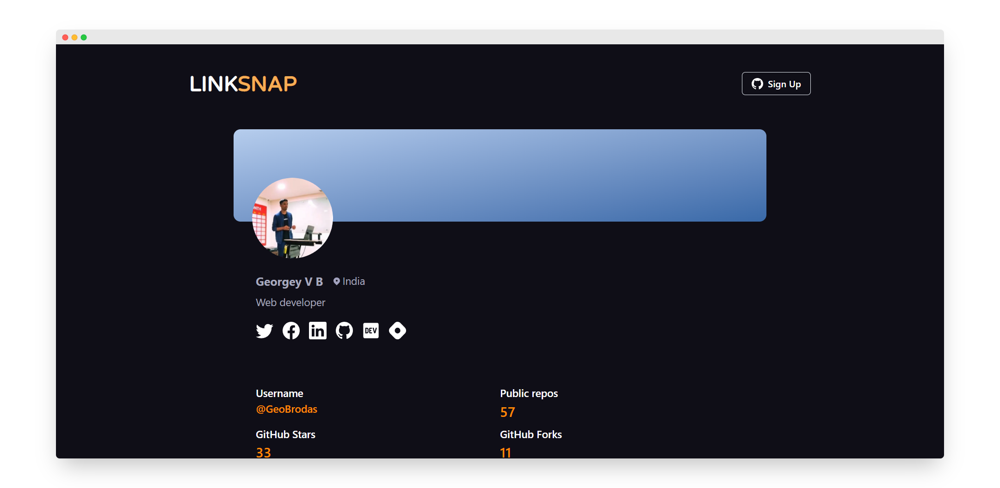

<h2 align="center">Linksnap - One place for all your links</h2>

<p align="center">Free, Open source, and built for the community❤️</p>

<br />

## What's Linksnap?

Linksnap is a LinkTree/Biolink alternative for developers to showcase their activity across different platforms like GitHub, Hashnode, Dev.to.

### ✨ Features

- 🕊️ Lightweight and Easy to use!
- 🔗 Create shareable links.
- 😺 Fetch Stats from your favourite platforms.
- 🤹🏽 Responsive across multiple devices.

### 🔨 Roadmap

- [ ] Fetch stats from Dev.to
- [ ] Customize the theme on your profile.
- [ ] PWA Support
- [ ] Implement likes on Profile Page
- [ ] See Profile Insights (views, likes, etc)
- [ ] Modify your profile URL.
- [ ] Dynamic Og meta images
- [ ] Grab stats from more platforms (Youtube?, etc.)
- [x] Fetch Stats from Hashnode
- [x] Fetch Stats from GitHub

### 🚀 Tech Stack

- [PlanetScale](https://planetscale.io)
- [Next.js](https://nextjs.org)
- [Chakra-UI](https://chakra-ui.com)
- [React-Hook-Forms](https://react-hook-form.com/)
- [NextAuth](https://nextauth.js.org)

### Developement

- Fork the repository

```bash
git clone https://github.com/GeoBrodas/linksnap.git
```

- Install dependencies

```bash
npm install
```

- Create a file called `.env` and add the following lines:

```bash
PLANETSCALE_PRISMA_DATABASE_URL=
NEXT_PUBLIC_MY_SECRET_TOKEN=
GITHUB_ID=
GITHUB_SECRET=
NEXTAUTH_SECRET=
NEXTAUTH_URL=
NEXT_PUBLIC_BASE_URL=
```

- Create the secret keys for NEXTAUTH_SECRET by running the following command:

```bash
node -e "console.log(crypto.randomBytes(32).toString('hex'))"
```

- Finally, run the following command to spin up the server:

```bash
npm run dev
```

### Contributing

For contributing, please visit the [Contributing Guide]()

Thank you [Hashnode](https://hashnode.com) and [PlanetScale](https://planetscale.com) for organising the [PlanetScale x Hashnode hackathon](https://townhall.hashnode.com/planetscale-hackathon?source=hashnode_countdown) 🎆
